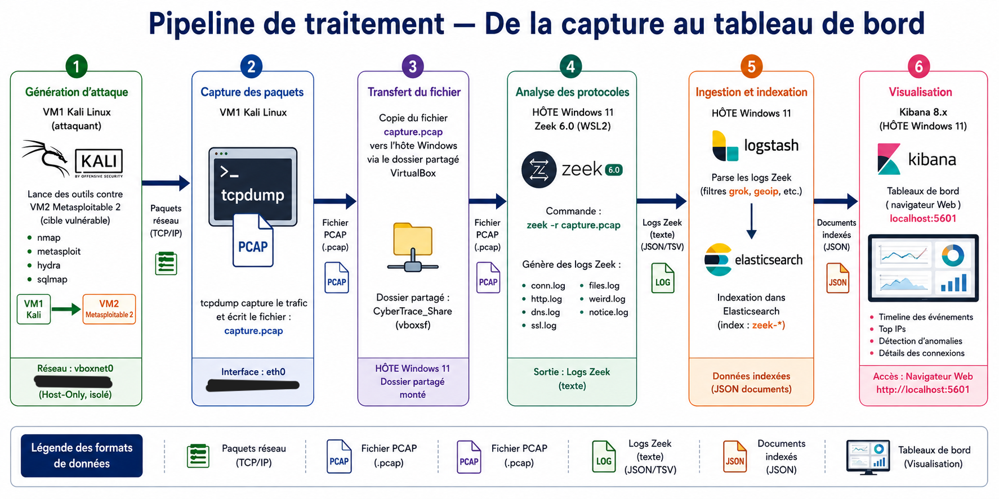
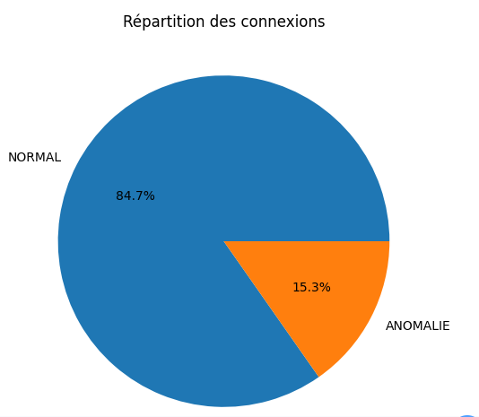
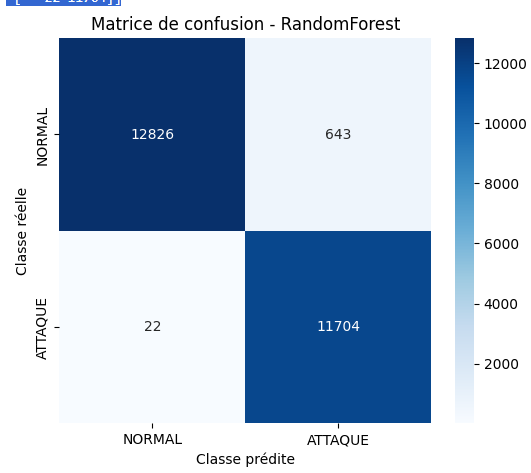
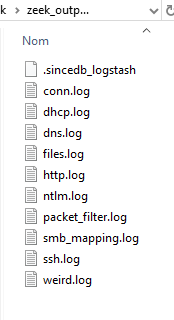
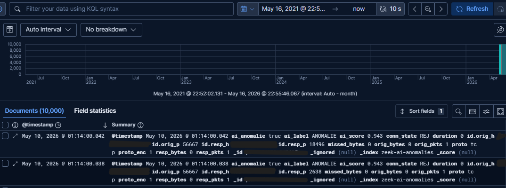
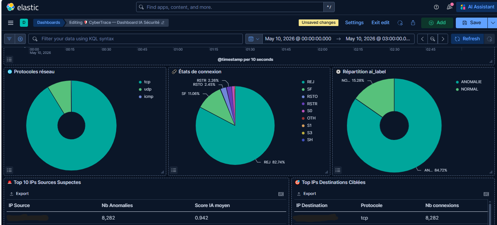
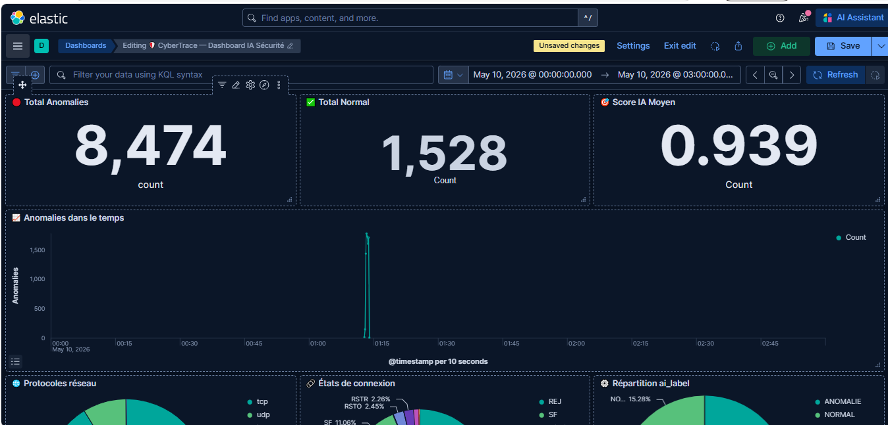
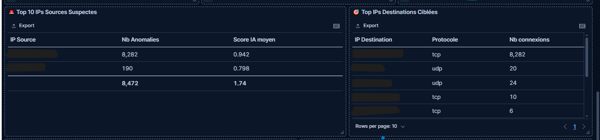
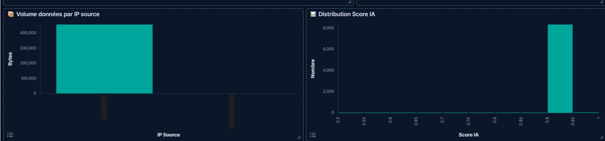
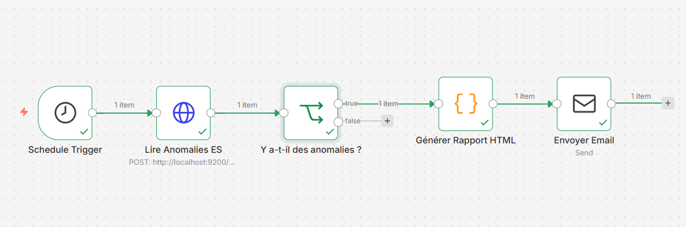

<div align="center">

# 🛡️ CyberTrace

### AI-Powered Network Traffic Analysis & Anomaly Detection System

[](https://python.org)
[](https://elastic.co)
[](https://elastic.co/kibana)
[](https://zeek.org)

</div>

---

## 📋 Table of Contents

- [Overview](#overview)
- [Pipeline Architecture](#pipeline-architecture)
- [AI Model](#ai-model)
- [Tech Stack](#tech-stack)
- [Results](#results)
- [Dashboard Screenshots](#dashboard-screenshots)

---

## 🔍 Overview

CyberTrace is a complete automated network intrusion detection system that combines:

- Network traffic analysis (Zeek IDS)
- Machine learning (Random Forest)
- Data visualization (Kibana)
- Alert automation (N8N)

It detects anomalies with **97% accuracy**.

---

## 🏗️ Pipeline Architecture



### Data Flow

| Step | Component | Input | Output |
|------|-----------|-------|--------|
| 1 | Attack Simulation | Network traffic | Raw packets |
| 2 | PCAP Capture | Raw packets | `.pcap` |
| 3 | Zeek IDS | `.pcap` | JSON logs |
| 4 | Logstash | logs | Elasticsearch |
| 5 | Elasticsearch | data | Index |
| 6 | AI Model (Colab) | CSV | Predictions |
| 7 | Kibana | ES | Dashboard |
| 8 | N8N | anomalies | Email alerts |

---

## 🧠 AI Model

- **Algorithm**: Random Forest (scikit-learn)
- **Dataset**: NSL-KDD (125,973 samples)
- **Classification**: Binary (NORMAL / ANOMALY)

### Model Performance





### Severity Levels

| Level | AI Score | Action |
|------|----------|--------|
| 🔴 CRITICAL | ≥ 0.90 | Immediate action |
| 🟠 HIGH | 0.75–0.89 | Investigation |
| 🟡 MEDIUM | 0.60–0.74 | Monitoring |
| 🟢 LOW | 0.50–0.59 | Watch list |

---

## 📊 Results

- ✅ NORMAL: 1,528 (15.3%)
- 🚨 ANOMALY: 8,472 (84.7%)
- 🎯 Avg AI score: 0.939


------


## 🚀 Quick Start (Summary)

```bash
# 1. Start ELK Stack
C:\elk\elasticsearch-9.3.2\bin\elasticsearch.bat
C:\elk\logstash-9.3.2\bin\logstash.bat -f C:\elk\logstach.conf
C:\elk\kibana-9.3.2\bin\kibana.bat

# 2. Analyze PCAP with Zeek (WSL2)
mkdir -p /mnt/c/elk/zeek_output && cd /mnt/c/elk/zeek_output
zeek -r /mnt/c/elk/capture_totale.pcap LogAscii::use_json=T

# 3. Verify data
curl http://localhost:9200/zeek-*/_count

# 4. Run AI model (Google Colab)
# Upload cybertrace_colab.ipynb → run all cells → download resultats_ia.csv

# 5. Inject AI results
python inject_results.py

# 6. Import Kibana dashboard

curl -X POST "http://localhost:5601/api/saved_objects/_import?overwrite=true" \
  -H "kbn-xsrf: true" \
  --form file=@kibana/cybertrace_dashboard.ndjson
```
## 📸 Screenshots
###  Zeek Output


### Kibana Discover



### Dashboard









### N8N Workflow




---

## 📄 License

This project is licensed under the MIT License — see LICENSE file.

---

